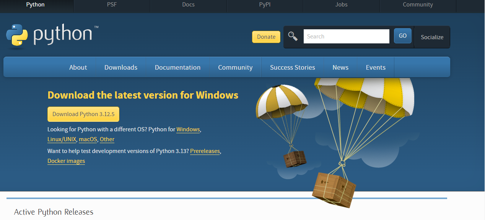

# Python Programming tutorial

# Note!

### This tutorial is for those who are already familiar with programming, and want to learn python. I will try to make this course as easy as possible Inshaa Allah.

## [Step 1 : Setup the environment](#step-1-setup-the-environment)

### [Step 1.1 : Download and Install Interpreter](#step-11-download-and-install-interpreter)

### [Step 1.2 : Check interpreter installation](#step-12-check-interpreter-installation)

### [Step 1.3 : Run the program](#step-13-run-the-program)

### [Step 1.4 : If not working fix](#step-14-if-not-working-fix)

## [Step 2 : About Python](#step-2-about-python)

## [Step 3 : Learn Python](#step-3-learn-python)

### [Step 3.1 : Input and Output](#step-31-input-and-output)

### [Step 3.2 : Variables](#step-32-variables)

### [Step 3.3 : What are Variables](#step-33-what-are-variables)

## [Step 3.2 : Datatypes](#step-32-datatypes)

## [Step 3.2.1 : Primitive Datatypes](#step-321-primitivebasic-datatypes)

### [1 : Strings](#1-strings)

#### [1.1 : Valid Strings](#11-valid-strings)

#### [1.2 : Invalid Strings](#12-invalid-strings)

#### [1.3 : Recommended](#13-recommended)

### [2 : Integers](#2-integers)

## [Step 3.2.2 : Non-Primitive Datatypes](#step-322-nonprimitivecomplexcompound-datatypes)

### [1 : Lists](#1-lists)

#### [List Methods](#11-acsessing-through-indices)

#### [1.1 : Indices](#11-accessing-through-indices)

#### [1.2 : Adding new elements](#12-adding-new-elements)

#### [1.3 : Extending list](#13-extending)

#### [1.4 : Removing the Element](#14-removing-the-element)

#### [1.5 : Pop method](#15-pop-method)

#### [1.6 : Index method](#16-index-method)

#### [1.7 : Count method](#17-count-method)

#### [1.8 : Sort method](#18-sort-method)

#### [1.3 : Reversing list](#19-reverse-method)

### [2 : Tuples](#2-tuples)

#### [2.1 : Example of tuple](#21-example-of-tuple)

#### [2.2 : Advantages of tuple](#22-advantages-of-tuple)

#### [2.3 : Count Method](#23-count-method)

#### [2.4 : Index method](#24-index-method-tuple)

## Step 1. Setup the environment.

To get started with installation you have to follow these steps:

### Step 1.1. Download and Install Interpreter

### Go to [python.org](https://www.python.org/downloads/) and click on download button to install latest interpreter.



During Installation it asks for an option _add interpreter to path_ or _add .bin folder to path_ something like this. Make sure to check this option.

### Step 1.2. Check interpreter installation

Once it's installed open your VS code or any other IDE, create a file with name **new.py**

in file write following line of code.

```Python
print('I am running')
```

### Step 1.3. Run the Program

if you have [code runner](https://marketplace.visualstudio.com/items?itemName=formulahendry.code-runner) extention installed run the file to print **I am running**.

### Step 1.4. If not working fix

If this doesnot work it probably means your environment varaibles in path are not properly set, or you are not running it properly.
In that case follow this page to setup environment variables [Set environment variables for python](https://realpython.com/add-python-to-path/)

**Note** : you don't need this step if you follow step 1.1 correctly, and your program is running, this step is to make program running.

## Step 2. About Python

## Step 3. Learn Python

### Step 3.1. Input and Output

### Output

```Python
print('simple print statement like this displays output on screen')
```

### Input

```Python
input('simple input statement like this displays the text on screen and wait for user to input any thing(number or string)')
```

### Step 3.2. Variables

Above we have inputed the data and doesn't store it into any variable, so you might run into problems while running above code.

## Corrected Code

```Python
str = input('This time the input will store into the variable str')
```

### Note : Python always by default take input as strings, to take integers as input are defined in section Datatypes.

## **Step 3.3. What are Variables**

_Variables_ are like containers in memory that stores the data, as you are already familiar with. So in python there is no need of declaration of variables seperately as in other programming languages. you can just _initialize_ it like that.

```Python
num = 10
```

To initialize variable will _null_ we use keyword _none_ in python.

```Python
num = none
```

### **Step 3.2. Datatypes**

### **Step 3.2.1. Primitive/Basic Datatypes**

Every variable in python also has datatype as in any other language but the main difference is, it provides alot of flexibility becuase you don't have to mention datatype explicitly, as our interpreter understands the datatype on its own.

### Example

```Python
num = '12'
```

Here above num has datatype string so our interpreter is already aware of it.

```Python
num = 12
```

Here above num has datatype integer so our interpreter is already aware of it because it is written without quotes.

## **1. Strings**

String variables are those variables in which data has single quotes _''_ or double quotes _""_ about it

## **1.1. Valid Strings**

```Python
my_str = 'It is a string with single quotes'
```

```Python
my_str = "It is a string with double quotes"
```

Numbers can be string when surrounded by quotes.

```Python
my_str = '12'
```

## **1.2. Invalid Strings**

```Python
my_str = 'It is a Invalid because starting and ending quotes type mismatched"
```

## 1.3. _Recommended_

It is recommended to use single quotes when using double quotes inside, and using double quotes around if using single inside.

### **Example**

```Python
my_str = "It's my book"
```

```Python
my_str = 'He said : "It\'s my book"'
```

In cases like above we have to use [escape sequences](https://www.scaler.com/topics/escape-sequence-in-python/)

### _[escape sequences](https://www.scaler.com/topics/escape-sequence-in-python/) are used for special type of characters in strings like \n for new line, \t for tab spaces etc_

## **2. Integers**

Integer datatype is used to represent numbers, a string number is not equal to a integer number.

```Python
'23' == 23 // False
'23' == '23' // True
23 == 23 // True
```

### **Note** : Operators like +, -, \*, / are applied to both integers and strings but thier usecases are different in both.

## **Step 3.2.2. Non Primitive/complex/compound Datatypes**

## **1. Lists**

List are an example of non primitive data types, because these are the combinations of primitive datatypes.

Like in C/C++ we have an array, that is the collection of homogenous data items at one place, and accessed through index.

Similarly in python, they can be accessed by indices, but they are collection of non homogenous data items or homogenous data items depending on our preference.

### **Example**

```Python
my_list = ['Ebad-ur-Rehman', 20, 'Computer Science']
```

This is completely valid in python to include integers strings, and even other datatypes like sets, dictionaries, and tuples within a list.(I will discuss about other datatypes later.)

### 1.1. Accessing through indices.

```Python
my_list = ['Ebad-ur-Rehman', 20, 'Computer Science']
print(my_list[0]) # displays Ebad-ur-Rehman on console
print(my_list[1]) # displays 20 on console
print(my_list[2]) # displays Computer Science on console
```

### 1.2. Adding new Elements

### **At last of List**

```Python
my_list.append('AI')
print(my_list) #['Ebad-ur-Rehman', 20, 'Computer Science' ,'AI']
```

### **Anywhere**

```Python
# inserting at 0 index
my_list = ['Ebad-ur-Rehman', 20, 'Computer Science']
my_list.insert(0, 'AI')
my_list = ['AI', 'Ebad-ur-Rehman', 20, 'Computer Science']
```

```Python
# inserting at 2 index
my_list = ['Ebad-ur-Rehman', 20, 'Computer Science']
my_list.insert(2, 'AI')
my_list = ['AI', 'Ebad-ur-Rehman', 'AI', 20, 'Computer Science']
```

### 1.3. Extending

`.extend()` adds a list at the end of our list

## Method 1

```Python
list1 = ['Ebad-ur-Rehman', 20, 'Computer Science']
list2 = ['AI', 'Data Structure']
list1.extend(list2)
print(list1)
#['Ebad-ur-Rehman', 20, 'Computer Science', 'AI', 'Data Structure']
```

### **Alternative method**

```Python
list1 = ['Ebad-ur-Rehman', 20, 'Computer Science']
list1.extend(['AI', 'Data Structure'])
print(list1)
#['Ebad-ur-Rehman', 20, 'Computer Science', 'AI', 'Data Structure']
```

## **1.4. Removing the Element**

`.remove` method removes the first occurence of the element in the list.

### **Example**

```Python
list1 = ['Ebad-ur-Rehman', 20, 'Computer Science', 20]
list1.remove(20)
print(list1)
#['Ebad-ur-Rehman', 'Computer Science', 20]
```

## **1.5. Pop method**

`.pop` method removes the element form the list and return it to an element.

```Python
list1 = ['Ebad-ur-Rehman', 20, 'Computer Science']
poped_element = list1.pop(20)
print(list1)
#['Ebad-ur-Rehman', 'Computer Science']
print(poped_element) #20
```

Without an argument it returns the last element

```Python
list1 = ['Ebad-ur-Rehman', 20, 'Computer Science']
poped_element = list1.pop()
print(list1)
#['Ebad-ur-Rehman', 20]
print(poped_element) #'Computer Science
```

## **1.6. Index method**

`.index()` method is used to find index of a specific element.

```Python
list1 = ['Ebad-ur-Rehman', 20, 'Computer Science']
# element to find index of
element = 20
index_of_element = list1.index(element)
print(index_of_element) #1
```

## **1.7. Count method**

`.count()` method finds occurence of an element in string and returns it.

```Python
list1 = [12, 20, 30, 20]
# no of occurences of 20 is 2
print(my_list.count())
```

**Note** We can use a function that returns something inside a print statement.

## **1.8. Sort method**

`.sort()` methods convert list into ascending or decsending order.

```Python
# ascending order
list1 = [12, 20, 30, 20]
list1.sort()
print(my_list) #[12, 20, 20, 30]

```

```Python
# decending order
list1 = [12, 20, 30, 20]
my_list.sort(reversed=True)
print(my_list) #[30, 20, 20, 12]

```

## **1.9. Reverse method**

`.reverse()` methods convert list into ascending or decsending order.

```Python
# reverse order
list1 = [12, 20, 30, 20]
list1.reverse()
print(my_list) #[20, 30, 20, 12]

```

## **2. Tuples**

Tuple is a datastructure just like list. but the difference is tuple is immutable, this means we can't edit an element in tuple once it is created.

### **2.1. Example of tuple**

Tuple is written just like arrays, but with surrounding round brackets `()`.

```Python
# decending order
tuple1 = (12, 20, 30, 20)
tuple1.insert(0, 3) # error because tuple doesnt support insert

```

`Note : Similarly tuple don't support other methods of list which involves changing existing element of tuple, as well as we can't add any new elements to it.`

### **2.2. Advantages of tuple**

Why Tuples are Used:

**Immutability :** Tuples are immutable, meaning their contents cannot be modified after creation. This makes them more efficient and safe for use when you need data that should not be altered (e.g., constants, function returns).

**Faster than Lists :** Since they are immutable, tuples can be faster than lists in situations where the data doesn’t need to be modified.

**Hashable :** Tuples can be used as keys in dictionaries, unlike lists. This is because tuples are immutable and hashable.

**Memory Efficiency :** Tuples use less memory compared to lists, making them more efficient for storing large amounts of data that won't change.

## **Some tuple methods**

## 2.3. Count method

`.count()` method is valid for both list and tuple and used to count number of occurences of a special element.

```Python
my_tuple = (11, 2, 3, 4, 2, 2)
count_of_2 = my_tuple.count(2)
print(count_of_2) #3(2 is present 3 times in this tuple)
```

## 2.4. Index method tuple

`index method works in tuple same as it does in lists` see for details. [List Index method](#index-method)


## 3. Sets

Sets is a collection of distinct elements, this means they can't contains any duplicates.

If we want to add any duplicate into it, it just ignores.

### 3.1. Syntax

```Python
# declaring an empty set to put values later
empty_set = Set()
```

### Note : Sets are mutable that means they can change elements in them after declaring them.

### Important : Sets uses hashmaps this means they have best time complexity of O(1), and Worst Complexity of O(n) as hashmaps do.

### Declaring Non Empty Set
```Python
my_set = {1, 3, 4 5}

# alternatively
my_set = Set({1, 3, 4 ,5})
```

### Set Methods
## Add Method
`.add()` method for sets add a new value for the set, but the condition is the value already doesn't exist in the set, If it does then there is also not a problem, it will not add it, and simply ignore it.

```Python
# adding a non existent value
my_set = {1, 3, 4, 5}
my_set.add(7) 
print(my_set) # {1, 3, 4, 5, 7}

# adding a existent value
my_set = {1, 3, 4, 5}
my_set.add(3) 
print(my_set) # {1, 3, 4, 5}
```


### Update method
`.update()` method is used to add multiple elements in the set

```Python
my_set = {1, 3, 4, 5}
my_set.add([6, 7]) 
print(my_set) # {1, 3, 4, 5, 6, 7}
```

### Remove and Discard method
Both `.remove()` and `.discard()` methods removes the specific element but behaves differently in one case.

`.remove()` method raise a key error when key element is not found in the set.

`.discard()` method don't raise a key error when key element is not found in the set.


## Other Important method for sets.
`Sets` in python have same concept as we have in mathematics, so we also have some methods that are specific for set operations in mathematics.

### Union

```Python
# union take element form both sets and ignore duplicates(i.e. if an element is found in both set)
set1 = {1, 4, 3}
set2 = {4, 5, 6}
set1.union(set2)
print(set1) # {1, 4, 3, 5, 6}
```


### Intersection

```Python
# intersection find common elements
set1 = {1, 4, 3}
set2 = {4, 5, 6}
set1.intersection(set2) 
print(set1) # {4}
```


### Difference

```Python
# difference finds the elements that are in 1st set not in 2nd.
# Here first set is set1 because we call method through it
set1 = {1, 4, 3}
set2 = {4, 5, 6}
set1.difference(set2) # {1, 3}
```


### Symmetric Difference

```Python
# returns the element that are not common
set1 = {1, 4, 3}
set2 = {4, 5, 6}
set1.symmetric_difference(set2) # {1, 3, 5, 6}
```

## Funtion that return boolean value
### Subset

```Python
set1 = {1, 4, 3}
set2 = {4, 5, 6}
set3 = {1, 4}

set1.issubset(set2) # False

set3.issubset(set1) # True
```

### Superset

```Python
set1 = {1, 4, 3}
set2 = {4, 5, 6}
set3 = {1, 4}

set1.issuperset(set2) # False

set1.issuperset(set3) # True
```

### Disjoint
`.isdisjoint()` method returns `True` if there are no common elements in both sets, and false when there is common elements in the set.

```Python
set1 = {1, 2, 3}
set2 = {4, 5, 6}
set3 = {1, 4}

set1.isdisjoint(set2) # False

set2.issdisjoint(set3) # True
```


# 4. Dictionaries

`Dictionaries` are very useful datatype in most of the programming languages.

In `Javascript` It just refers to as object.

In `Python` it is a muteable data structure that has `(key, value)` pairs, the keys are used to access thier corresponding values.

There may be multiple same values, but not mulitple same keys.

Dictionaries also uses hash tables, and consider very efficient data structure as it also has best time complexity of O(1), and worst of O(1) time complexity.

But they might be cosuming more space.

### When to use Set and Dictionary
If you want better time complexity, and data has no duplicates to store, set might be a good option along with other factors, if we want to use multiple values the dictionary might be a good option.

# Uses of datastructure Optional to understand
All Data structures have some other interesting uses for solving some problems. For Example, Dictionary can be used to count number of all repeated letters in a string, and set might be use to remove duplicates, You can solve various problems like these on [leetcode.com](https://leetcode.com/)

## Empty Dictionary Declaration

```Python
my_dict = {}
print(my_dict) # {}
```

## Dictionary Initialization

```Python
my_dict = {
    'key1': value1,
    'key2': value2
}
print(my_dict) # {}
```

Values can be variables of any types, but datatype of keys must be either `int` or `string`.

### Example

```Python
value1 = [1, 2, 3 4]
value2 = (2, 3, 4, 5)
value3 = 'string value'
my_dict = {
    'key1': value1,
    'key2': value2
    'key3', value3
}
print(my_dict)
 '''

result 

{
    'key1': [1, 2, 3 4],
    'key2': (2, 3, 4, 5)
    'key3', 'string value'
}
'''
```

### `Alternatively`

You can assign values directly into the dictionary like that.

```Python
my_dict = {
    'key1': [1, 2, 3 4],
    'key2': (2, 3, 4, 5)
    'key3', 'string value'
}
print(my_dict)
 '''

result 

{
    'key1': [1, 2, 3 4],
    'key2': (2, 3, 4, 5)
    'key3', 'string value'
}
'''
```

### `Recommended`
It is recommended to give keys a meaning full name so you can access, and remember them easily.

```Python
fruit_rates = {
    'apples': 100,
    'mangoes': 250,
    'bananas', 150
}
print(my_dict)
 '''

result 

{
    'apples': 100,
    'mangoes': 250,
    'bananas', 150
}
'''
```

### Usecases of Dictionaries.
As you can see in above example we have fruits as keys and thier rates as thier corresponding values.

So, How can we access that values, if someone want to find rate of apples, what he will do to get it.

```Python
# getting fruite rate of apple
print(fruit_rates['apples'])

# alternatively
print(fruit_rates.apples)
```

### Looks Familiar
In lists we use my_list[`index`] to get the value at that particular index location, but the difference is here indices can be strings, and obviously it is more efficient that the array, as it uses hash maps.

### More Usecases.
Most important usecase of dictionary is that it can be used to store the table data as dictionary of lists.

If the `table` looks like this

| Fruits | Rates | Quantity | Total Price |
|----------|----------|----------|-------- |
| Apples | 100 | 2 | 200 |
| Mangoes | 200 | 1 | 200 |
| Bananas | 150 | 3 | 450 |

It's corresponding dictionary used to represent that data.

```Python
fruit_rates = {
    'Fruits': ['Rates', 'Quantity', 'Total Price'],
    'Apples': [100, 2, 200],
    'Mangoes': [200, 1, 200],
    'Bananas', [150, 3, 450]
}
```
